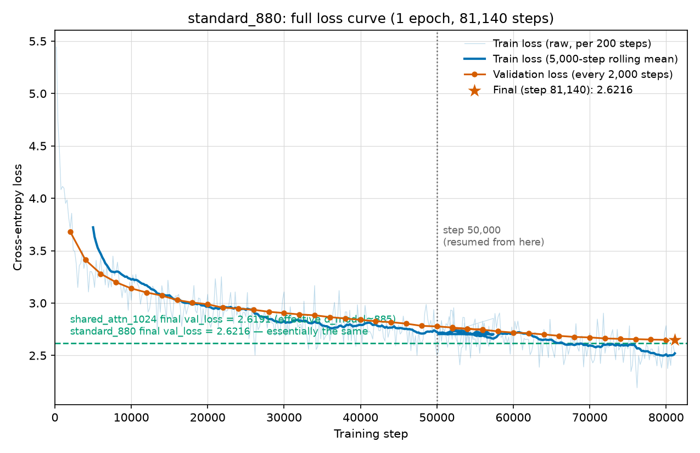

# standard_880 分析:`shared_attn_1024`の実効d_model≈883を直接検証

`mdfiles/sharing_comparison_report.md` §5.2で、`shared_attn_1024`(Attentionのみ全層共有)の実効d_modelが標準モデルのトレンド式から**≈883**と推定された。これは4点(d_model 256/512/768/1024)の回帰式による**外挿**であり、実際にd_model=880付近の標準モデルを学習して直接確かめた点ではなかった。この推定を検証するため、n_heads=8で割り切れる最近傍の標準モデル `standard_880`(d_model=880、`configs/model_880.yaml`)を追加で学習し、**1エポック完走した(2026-09-11)**。本稿はその最終結果の考察。

## 1. 結果:トレンド予測・`shared_attn_1024`とほぼ完全に一致

| | パラメータ数 | Val Loss | Val PPL |
| --- | ---: | ---: | ---: |
| **standard_880**(完走、`results.jsonl`) | 175,071,600 | **2.621633** | 13.758 |
| shared_attn_1024(完走) | 175,408,128 | 2.619147 | 13.724 |
| 標準トレンド予測値 @ d=880(旧4点フィット) | — | 2.6203 | — |

差はわずか**0.0025**(standard_880がshared_attn_1024よりごく僅かに高い)で、統計的には誤差範囲内(4点フィットの残差は±0.017〜0.026)。パラメータ数も175.07M vs 175.41Mでほぼ同一。

**`standard_880`を5点目として標準モデルのトレンド線に加えて再フィットすると:**

```
val_loss = -0.70832 × log10(d_model) + 4.70635   (R² = 0.9939、旧: 0.9930)
```

このフィットに基づく`shared_attn_1024`の実効d_modelは**884.5**(旧推定883とほぼ変わらず)。`standard_880`の実測点はこのトレンド線上にほぼ乗っており(下図の青丸が曲線上に整列)、外挿ではなく実測で「Attentionのみ共有は標準モデルのトレンドとほぼ同水準」という§5.2の結論を裏付けた。


## 2. Lossカーブ(全学習区間、1〜81,140step)



- 青:訓練損失(200step毎の生値、薄線)とその5,000step移動平均(太線)。オレンジ:検証損失(2,000step毎)、星印が最終値(step 81,140)。
- 緑の破線は`shared_attn_1024`の最終val_loss(2.6191)。`standard_880`の曲線は終盤(step 70,000〜81,140)にかけてこの線にほぼ収束している。

### 2,000step毎のval_loss減少幅(slope)

| 区間 | slope(per 2,000 steps) |
| --- | ---: |
| step 2,000→10,000 | -0.1356 |
| step 20,000→30,000 | -0.0168 |
| step 40,000→50,000 | -0.0126 |
| step 50,000→56,000 | -0.0107 |

途中経過(step 50,000, 61.6%進行)の時点ではval_loss=2.7774で、上記の通り緩やかに減少を続けている段階だった。まだ完全には平坦化しておらず、残り38%(cosine LRがpeakの約4割の強度から最終値3.0e-05まで下がる区間)でさらに0.15ほど改善し、最終的に目標値(2.62前後)へ収束した。これは「終盤ほどcosine LRの低下が効いて改善が伸びる」という典型的な挙動と整合する。

## 3. 結論

1. **`shared_attn_1024`(Attentionのみ全層共有)の実効d_model≈883〜885という推定は、外挿ではなく実測データ点(`standard_880`)によって直接裏付けられた。** §5.2の結論("Attentionのみの共有は標準モデルのスケーリング傾向とほぼ同水準の性能を維持できる")は、より強い根拠を持つ。
2. `mdfiles/sharing_comparison_report.md` §6「今後の課題」に記載されていた「共有バリアントはd_model=1024の1点のみで検証しており、他のd_modelサイズでも同じ傾向が成立するかは未確認」という限界は、少なくとも`shared_attn_1024`側については本実験で部分的に解消された(実効d_model相当の標準モデルを実際に学習し、ほぼ一致することを確認済み)。`shared_full_1024`(実効d_model≈339)側は未検証のまま。

## 4. 参考記録:step 50,000時点で何が分かっていたか

学習が2026-09-11 08:12頃に一度(エラーなく、外的要因と思われる原因で)停止し、`ckpt_step50000.pt`が最新チェックポイントだった時点で以下のように暫定判断していた:

- val_loss=2.7774(目標2.62から+0.16)、まだ単調減少中で平坦化の兆候なし → 「学習未完了によるギャップであり、共有ありに劣るとは言えない」と判断。
- `ckpt_step50000.pt`から`--resume`して再開することを決定。

結果的にこの判断は正しく、再開後(step 50,000→81,140、追加約9,930秒)で目標値まで収束した。
