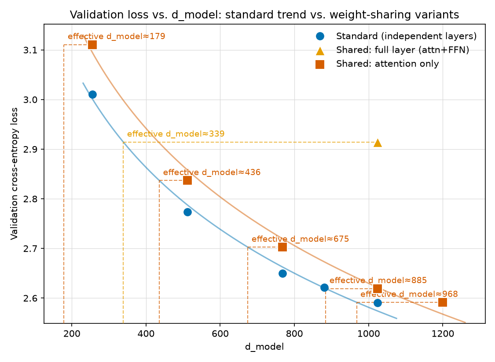
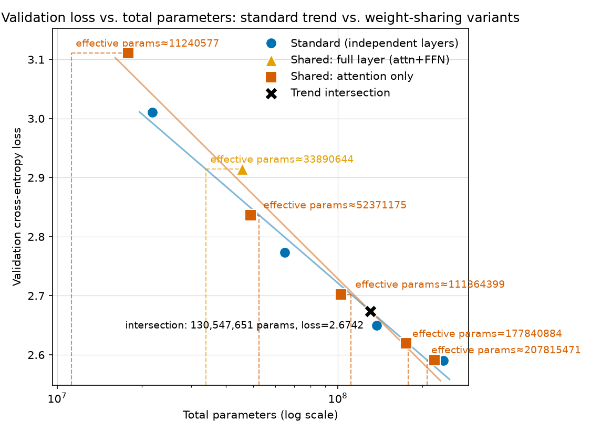
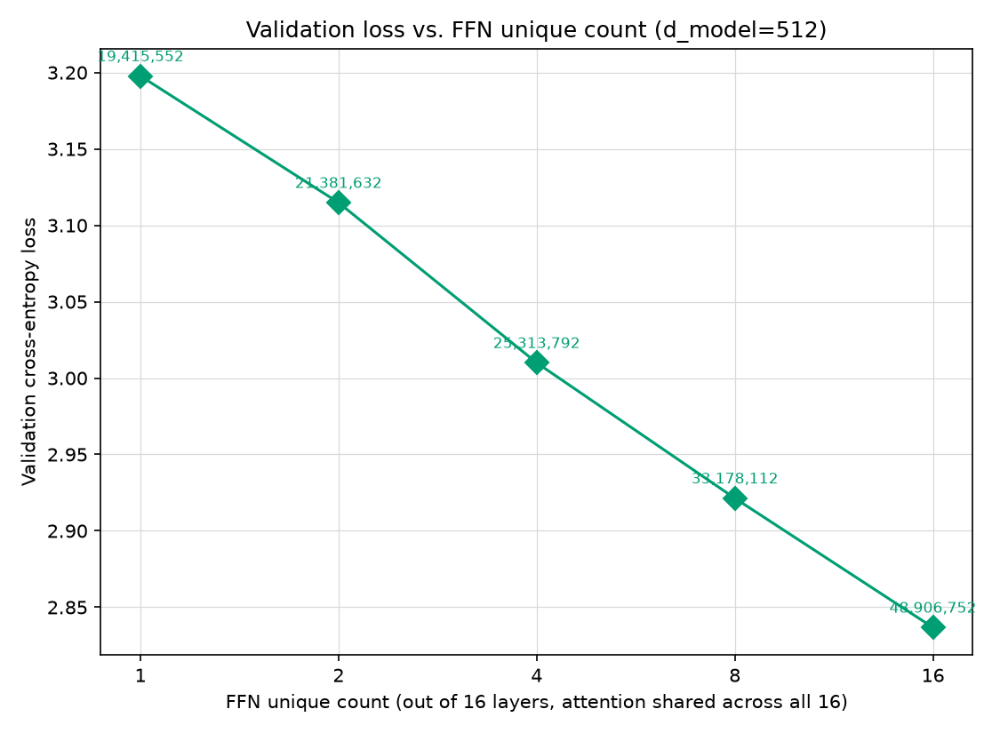
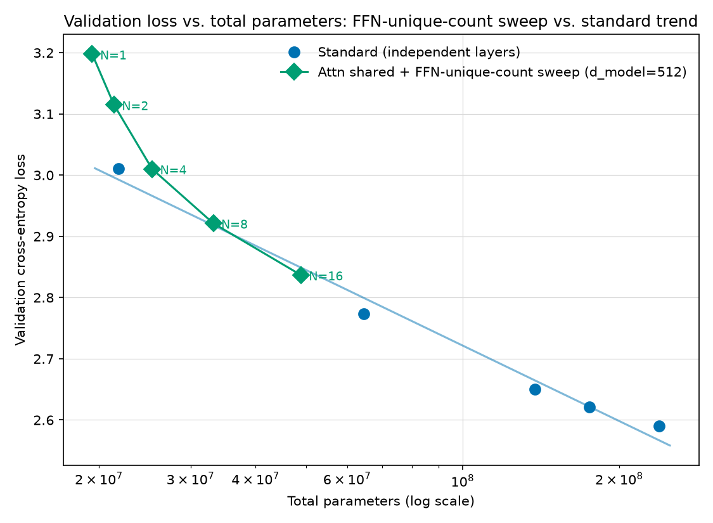
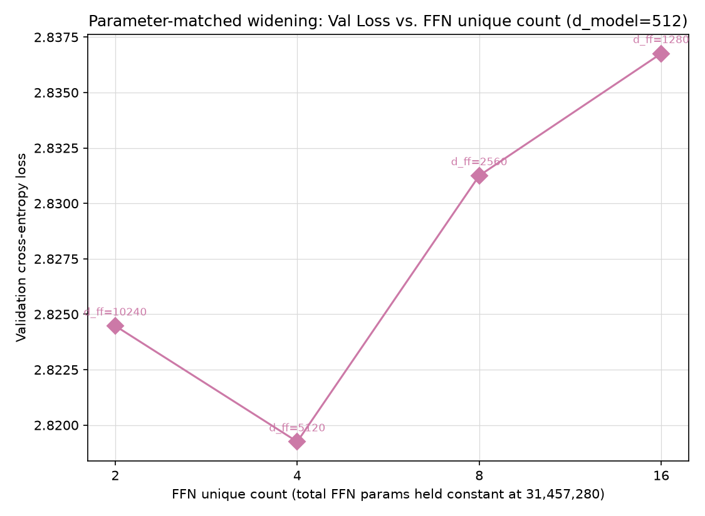
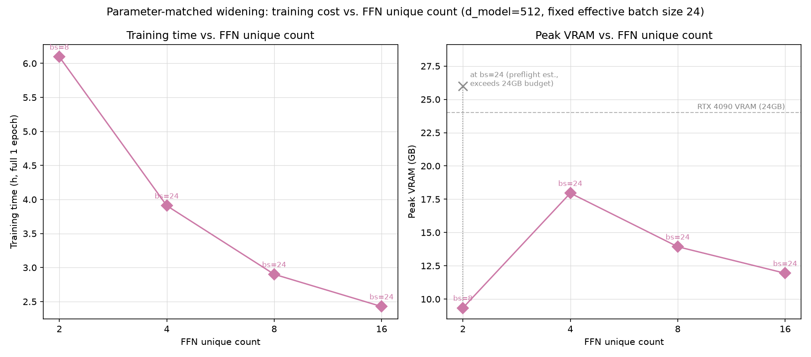

# 通常モデル vs 重み共有モデル 比較実験レポート

## 1. 概要

Llama系Decoder-only Transformer(RMSNorm, RoPE, SwiGLU FFN, Weight Tying)について、以下3種類のアーキテクチャを、同一の日本語コーパス・同一の学習条件(1Bトークン、1 Epoch)で比較した。

1. **標準モデル**:各層のAttention/FFNが完全に独立(4種類のd_modelで比較)
2. **全層共有モデル**:Decoder Layer全体(Attention+FFN)を全16層で共有
3. **Attentionのみ共有モデル**:Self-Attentionのみ全層共有、FFN・LayerNormは各層独立

結論:**Attentionのみの共有は、標準モデルのスケーリング傾向とほぼ同水準の性能を維持できる一方、FFNまで共有すると顕著な性能低下(パラメータ効率の低下)が生じる。**

## 2. 実験設定

### 2.1 モデル共通仕様

- 16層、SwiGLU FFN、`intermediate_size = round((8/3 × d_model) / 256) × 256`(全モデル共通の丸め規則)
- Attention Head数:8固定
- 入力Embeddingと出力Head:Weight Tying
- Context Length:512
- RoPE(theta=10000.0)、RMSNorm(eps=1e-5)

### 2.2 比較モデルとパラメータ数(実測)

| モデル | d_model | intermediate_size | attn_sharing | ffn_sharing | 総パラメータ数 |
| --- | ---: | ---: | --- | --- | ---: |
| standard_256 | 256 | 768 | none | none | 21,831,936 |
| standard_512 | 512 | 1,280 | none | none | 64,635,392 |
| standard_768 | 768 | 2,048 | none | none | 137,847,552 |
| standard_1024 | 1,024 | 2,816 | none | none | 238,322,688 |
| shared_full_1024 | 1,024 | 2,816 | full | full | 45,646,848(standard_1024比 **19.2%**) |
| shared_attn_1024 | 1,024 | 2,816 | full | none | 175,408,128(standard_1024比 **73.6%**) |
| standard_880(検証用、後日追加) | 880 | 2,304 | none | none | 175,071,600(shared_attn_1024とほぼ同数) |
| shared_attn_1200(検証用、後日追加) | 1,200 | 3,072 | full | none | 221,146,800(standard_1024比 **92.8%**) |
| shared_attn_256(検証用、後日追加) | 256 | 768 | full | none | 17,899,776(standard_256比 **82.0%**) |
| shared_attn_512(検証用、後日追加) | 512 | 1,280 | full | none | 48,906,752(standard_512比 **75.7%**) |
| shared_attn_768(検証用、後日追加) | 768 | 2,048 | full | none | 102,458,112(standard_768比 **74.3%**) |

### 2.3 Tokenizer

**GPT-NeoX-Japanese**(`abeja/gpt-neox-japanese-2.7b`、vocab_size=32,000)を採用。

選定理由:
- 候補だったLLM-jp v2.2は、指定された語彙数48,588に一致する実体が確認できず、実験条件の数値的根拠(パラメータ数の目安表)とも整合しなかった
- GPT-NeoX-Japaneseのvocab_size=32,000は、PRDのパラメータ数目安表(22M/65M/138M/238M)を実測値でほぼ完全に再現でき、想定されていたTokenizerと判断した

特殊トークン:bos_token_id=31996(`<|startoftext|>`)、eos_token_id=pad_token_id=unk_token_id=31999(`<|endoftext|>`)。EOSは各文(コーパスの各行)の末尾に付与し、Packed Sequenceの文書境界として利用した。

### 2.4 コーパス

`wikimedia/wikipedia`(20231101.ja)を`datasets`ライブラリでストリーミング取得。746,686記事、約4.35GBの生テキストを収集し、トークナイズ後に**ちょうど1,000,000,000トークン**へ切り詰めた(全モデル完全に同一のトークン列を使用)。

- Train: 998,999,784トークン(1,947,368チャンク)
- Validation: 999,837トークン(1,949チャンク、val_fraction=0.001)
- 保存形式:uint16フラットバイナリ(np.memmap)、513トークン単位(input 512 + shifted label 512、うち先頭511トークンが重複)のNon-overlappingチャンク

### 2.5 Packed Sequence Mask

複数文をEOSで連結してパッキングし、通常のCausal Maskに加えて、EOSを跨いで前方の文を参照できないようマスクを実装(`scratch_llm/model/packed_mask.py`)。各トークンにセグメントIDを付与し、「同一セグメントかつ因果的に過去」の場合のみAttentionを許可する。

### 2.6 学習条件

- batch_size=24、grad_accum_steps=1(1 optimizer stepあたり12,288トークン)
- max_steps=81,140(= n_train_chunks(1,947,368) // batch_size(24)、1 Epochちょうど)
- lr=3.0e-4→3.0e-5(cosine, warmup 300 steps)、AdamW(β1=0.9, β2=0.95, wd=0.1)、dtype=bf16
- 実行環境:RTX 4090(24GB)単体、Windows

## 3. 実装・実行時に発生した問題と対応

実験の過程で複数の技術的問題が発生し、いずれも根本原因を特定して修正した。

1. **トークナイズ時のSegmentation Fault**:`prepare_data.py`が全トークンをPythonのint リストに蓄積してから`np.array()`変換する実装だったため、1Bトークン超の処理で必要メモリが物理RAM(32GB)を超え、変換前にクラッシュしていた。可変長のnumpyバッファへ直接書き込む方式に修正し、`--max-tokens`到達時点で早期終了するようにした(回帰テスト追加済み)。
2. **batch_size=64でのCUDA OOM**:当初のtrain_compare.yamlはbatch_size=64を想定していたが、d_model=1024モデルで確実にOOMした。Packed Sequence Maskが原因かを検証したところ、マスクの有無でメモリ・速度に有意差はなく(20.3GB vs 20.6GB、無視できる差)、単純にモデル/バッチサイズの組み合わせがGPUメモリに対して大きすぎたことが原因と判明。batch_size=24(実測peak VRAM 20.6GB)に調整し、1 Epochのstep数を再計算した。
3. **バックグラウンド学習プロセスの度重なる中断**:6モデルの逐次学習中、外部要因(詳細不明、VSCodeでの大容量checkpointファイルアクセスが引き金になった可能性)により3回にわたりバックグラウンドプロセスが停止した。いずれもcheckpoint(`--resume`)から正常に再開でき、学習自体の破損はなかった。1回は最終結果の書き込み前に停止したため、保存済みの最終checkpointから評価をやり直して`results.jsonl`に復元した(該当行は`shared_attn_1024`、`train_time_sec`/`peak_vram_mb`は未計測)。

## 4. 結果

| run_name | 総パラメータ数 | Val Loss | Val PPL | 学習時間 | Peak VRAM |
| --- | ---: | ---: | ---: | ---: | ---: |
| standard_256 | 21,831,936 | 3.0102 | 20.29 | 1.44h | 8.99GB |
| standard_512 | 64,635,392 | 2.7731 | 16.01 | 2.48h | 12.16GB |
| standard_768 | 137,847,552 | 2.6499 | 14.15 | 4.34h | 16.15GB |
| standard_1024 | 238,322,688 | 2.5904 | 13.34 | 5.41h* | 21.65GB |
| shared_full_1024 | 45,646,848 | 2.9142 | 18.43 | 3.72h* | 17.98GB |
| shared_attn_1024 | 175,408,128 | 2.6191 | 13.72 | 約6.5h(推定) | 未計測 |
| standard_880(検証用) | 175,071,600 | 2.6216 | 13.76 | 2.97h* | 22.68GB |
| shared_attn_1200(検証用) | 221,146,800 | 2.5914 | 13.35 | 9.69h** | 11.74GB |
| shared_attn_256(検証用) | 17,899,776 | 3.1107 | 22.44 | 1.37h | 8.93GB |
| shared_attn_512(検証用) | 48,906,752 | 2.8368 | 17.06 | 2.43h | 11.94GB |
| shared_attn_768(検証用) | 102,458,112 | 2.7025 | 14.92 | 4.21h | 15.62GB |

*standard_1024とshared_full_1024はプロセス中断・再開を挟んだため、`train_time_sec`は最後の再開区間のみの値(1 Epoch自体は完走済み)。standard_880も同様にstep 50,000で一度中断し`ckpt_step50000.pt`から再開しており、`train_time_sec`は再開区間(step 50,000→81,140)のみの値。

**shared_attn_1200はhead_dim=1200/8=150となり、本機のPyTorch(Windows版)のSDPA高速カーネル(Efficient Attention/cuDNN Attention、head_dim≤128かつ8の倍数が必須)が使えず、低速な`math`実装にフォールバックした。その結果batch_size=24ではpeak VRAMが約26.3GBとなりRTX 4090の24GBを超過し、Windowsのドライバがエラーを出さずにシステムRAMへページングしたため、実測で約8〜9倍の速度低下(1.82秒/step)が発生した。原因を切り分けたのち、`configs/model_1200_shared_attn.yaml`・`configs/train_compare.yaml`は変更せず、起動時のCLI引数のみ`--batch-size 8 --grad-accum-steps 3`に変更(実効バッチサイズ24を維持、max_steps=81,140は不変)してVRAMを11.74GBまで下げ、0.43秒/step(標準的な水準)まで回復させて完走させた。詳細は開発メモを参照。

標準モデル4点は、d_model増加に伴いVal Lossが単調に減少しており、想定通りのスケーリング傾向を示した。





## 5. 考察

### 5.1 標準モデルのトレンドライン

標準モデル4点に対し `val_loss = m · log10(d_model) + c` の形で最小二乗フィットしたところ、

```
val_loss = -0.70917 × log10(d_model) + 4.70848   (R² = 0.9930)
```

と非常によく当てはまった(同様にlog10(総パラメータ数)に対するフィットもR²=0.983)。この式を逆算すると、任意のVal Lossを達成するのに標準モデルが必要とする「実効d_model」を推定できる。

(後日、`standard_880`を5点目として追加した後のフィットは `val_loss = -0.70832 × log10(d_model) + 4.70635`(R²=0.9939)で、ほぼ変化なし。詳細は§5.4。)

### 5.2 共有モデルの実効d_model・実効パラメータ数

各共有モデルのVal Lossを上記トレンド式に代入し、「同じVal Lossを達成する標準モデルの相当d_model / 相当パラメータ数」を求めた。

| モデル | 実際のd_model | 実効d_model(標準モデル換算) | 実際のパラメータ数 | 実効パラメータ数(標準モデル換算) | パラメータ効率 |
| --- | ---: | ---: | ---: | ---: | ---: |
| shared_full_1024 | 1,024 | **≈339**(全体の33%) | 45,646,848 | 33,893,097 | **約74%**(45.6M使って33.9M相当) |
| shared_attn_1024 | 1,024 | **≈883**(全体の86%) | 175,408,128 | 177,973,027 | **約102%**(175.4M使って178.0M相当、ほぼ標準トレンド通り) |

(パラメータ効率 = 実効パラメータ数 ÷ 実際のパラメータ数。100%に近いほど「標準モデルと同じ効率で容量が使えている」ことを意味する。)

### 5.3 考察

1. **FFN共有(shared_full_1024)は標準モデルのトレンドから明確に劣化する**。名目上のd_model=1024を持ちながら、実際の性能はd_model≈339の標準モデルと同水準にとどまる。パラメータ効率は約74%で、「16層ぶんのAttention+FFNを1組の重みに圧縮する」ことによる表現力の損失が大きいことを示している。
2. **Attentionのみ共有(shared_attn_1024)は標準モデルのトレンドとほぼ一致する**(実効d_model≈883、パラメータ効率約102%)。これは標準モデルのフィット残差(実測±0.017〜0.026)の範囲内であり、統計的に「標準モデルと同等」とみなせる。むしろ実際のパラメータ数(175.4M)は換算パラメータ数(178.0M)よりわずかに少なく、トレンドをわずかに上回っている(誤差範囲内だが、Attention共有によるパラメータ効率の低下が実質的に観測されなかったことを意味する)。
3. **FFNの独立性がモデル容量の主要な源泉である可能性を示唆する**。同じ「全層で1つの重みを共有する」操作でも、Attentionを共有した場合とFFNまで共有した場合とで実効容量への影響が大きく異なった(実効d_model 883 vs 339)。これは、FFN層が入力に依存しない「知識の貯蔵庫」的な役割を担うのに対し、Attentionは主に文脈内のトークン間の関係性(相対的な参照パターン)を計算する役割であり、後者の方が層間で再利用しやすい処理である、という一般的な仮説と整合する結果である。
4. **実務的な示唆**:限られたパラメータ予算でモデルを設計する場合、「全層共有(variant 2)」でパラメータを削減するよりも、「Attentionのみ共有(variant 3)」の方が性能劣化を最小限に抑えつつパラメータ数を削減できる(standard_1024比73.6%のパラメータで、Val Loss低下はわずか+0.029、standard_768とstandard_1024の中間よりstandard_1024に近い水準)。

### 5.4 追加検証:`standard_880`による実効d_model推定の直接確認

§5.2の「実効d_model≈883」は4点フィットからの**外挿**だったため、後日それを直接検証する目的で、n_heads=8で割り切れる最近傍のd_model(880 = 8×110)を持つ標準モデル `standard_880` を追加で学習した(パラメータ数175,071,600、`shared_attn_1024`の175,408,128とほぼ同数)。

結果、`standard_880`のVal Lossは**2.6216**(shared_attn_1024実測2.6191との差はわずか0.0025、フィット残差の範囲内)。これを5点目としてトレンド線を再フィットしても係数はほとんど変わらず(R²は0.9930→0.9939とむしろ改善)、`shared_attn_1024`の実効d_modelは883→884.5とほぼ同じ値に収束した。

**外挿ではなく実測によって、「Attentionのみ共有は標準モデルのトレンドとほぼ同水準」という結論の根拠が補強された。** 詳細な学習曲線・中断/再開の経緯は `mdfiles/model_880_interim_analysis.md` を参照。

### 5.5 追加検証:`shared_attn_1200`(Attention共有モデルのd_modelを1024から引き上げ)

`shared_attn_1024`が標準モデルのトレンドとほぼ同水準(パラメータ効率≈102%)だったことを受け、Attention共有モデルのd_modelを1200まで引き上げた場合に、パラメータ数はstandard_1024未満に抑えつつVal Lossでstandard_1024を上回れるか(=同じ設計のまま「サイズは小さく、性能は同等以上」を達成できるか)を検証した。

| モデル | 総パラメータ数 | Val Loss | 実効パラメータ数 | パラメータ効率 |
| --- | ---: | ---: | ---: | ---: |
| standard_1024(比較対象) | 238,322,688 | 2.5904 | ― | ― |
| shared_attn_1024 | 175,408,128 | 2.6191 | 177,840,884 | 約101.4% |
| shared_attn_1200 | 221,146,800 | 2.5914 | 207,815,471 | 約94.0% |

**結果:パラメータ数はstandard_1024より約7.2%少ない(221.1M vs 238.3M)が、Val Lossはわずかに上回った(2.5914 vs 2.5904、+0.0010)。** 差は標準モデルのフィット残差(±0.017〜0.026)より一桁小さく、統計的には「ほぼ同等」の範囲内だが、額面通り読めば「サイズが小さく、かつLossも小さい」の両方を同時に満たしてはいない。

もう一つの観点として、Attention共有モデル自体のパラメータ効率は、d_model=1024(約101.4%)からd_model=1200(約94.0%)にかけてわずかに低下している。2点のみでの比較のため断定はできないが、「Attentionのみ共有」という設計でも、d_modelを大きくするほど標準モデルとの差(効率の低下)がわずかに広がっていく可能性を示唆しており、shared_full_1024ほど極端ではないにせよ、無条件にスケールし続けられるわけではないかもしれない。

なお`shared_attn_1200`はhead_dim=150となり学習速度面で問題が発生した(§4の脚注**を参照)。これはモデルの表現力やVal Lossには影響しない実行環境固有の問題であり、上記の結果(パラメータ効率・Val Loss)はその影響を受けていない。

### 5.6 `shared_attn`系列をd_model=256〜1200のフルレンジで検証

`shared_attn_1024`・`shared_attn_1200`に加え、同一構成(Attentionのみ全16層共有、FFN・LayerNormは各層独立)のまま**d_model=256/512/768**でも新規に学習・評価し、Attention共有系列を標準モデルと同じ5点(256/512/768/1024相当/1200)でフルレンジ比較できるようにした。

| d_model | 総パラメータ数 | Val Loss | 実効d_model | d_model効率 | 実効パラメータ数 | パラメータ効率 |
| ---: | ---: | ---: | ---: | ---: | ---: | ---: |
| 256 | 17,899,776 | 3.1107 | 179.0 | **69.9%** | 11,240,577 | **62.8%** |
| 512 | 48,906,752 | 2.8368 | 436.0 | **85.2%** | 52,371,175 | **107.1%** |
| 768 | 102,458,112 | 2.7025 | 674.6 | **87.8%** | 111,364,399 | **108.7%** |
| 1,024 | 175,408,128 | 2.6191 | 884.5 | **86.4%** | 177,840,884 | **101.4%** |
| 1,200 | 221,146,800 | 2.5914 | 967.9 | **80.7%** | 207,815,471 | **94.0%** |

(効率 = 実効値 ÷ 実際の値。100%は「標準モデルと同じ効率で容量が使えている」ことを意味し、100%を超えるのは実測点が標準トレンド線よりわずかに下(良い)側に来た場合。)

**standard系列とshared-attention系列の比較:**

1. **中間サイズ(512〜1024)では標準モデルの傾向とほぼ一致、またはわずかに上回る**。パラメータ効率は101〜109%で、この範囲では「Attentionを共有しても実質的な性能劣化がない」という§5.3の結論がd_model=1024だけでなく512・768でも成立することを確認した。
2. **最小サイズ(d_model=256)だけ明確に効率が低い**(パラメータ効率62.8%、d_model効率69.9%)。他の4点が90%台後半〜109%に収まるのに対し、256だけが大きく外れている。モデル全体の容量が小さいときは、16層分のAttentionを1組に圧縮する影響(層ごとの特化を失うコスト)を吸収するだけの「余裕」が少なく、相対的な損失が大きくなる可能性がある。
3. **最大サイズ(d_model=1200)でも再び効率がやや低下する**(§5.5、パラメータ効率94.0%)。以上を合わせると、Attention共有系列の効率は d_model に対して**山型(小さすぎても大きすぎてもやや不利、中間の512〜1024付近が最も効率が良い)**という非単調なパターンが見えている。
4. **注意点**:各点は単一シード・1 Epochのみの結果であり、標準モデル側の5点フィット自体にも残差(±0.017〜0.026)がある。特にd_model=256の外れ具合(62.8%)がAttention共有固有の効果か、小規模モデル特有の分散(学習の初期不安定性など)によるものかは、複数シードでの再実行なしには断定できない。

両方のグラフ(`dmodel_vs_val_loss.png`・`totalparams_vs_val_loss.png`)にこの5点をすべて反映済み。

### 5.7 shared-attention系列自体のトレンドフィットと、standard系列との交点

`shared_attn_{256,512,768,1024,1200}`の5点にも、standard系列と同じ形で`val_loss = m・log10(x) + c`をフィットした(`shared_full_1024`は1点のみのためフィット対象外、単独点のまま)。

| 系列 | x軸 | フィット式 | R² |
| --- | --- | --- | ---: |
| Standard | d_model | val_loss = -0.70832 × log10(d_model) + 4.70635 | 0.9939 |
| Shared: attention only | d_model | val_loss = -0.78443 × log10(d_model) + 4.98298 | 0.9911 |
| Standard | 総パラメータ数 | val_loss = -0.40986 × log10(params) + 6.00054 | 0.9851 |
| Shared: attention only | 総パラメータ数 | val_loss = -0.47196 × log10(params) + 6.50447 | 0.9807 |

いずれもR²は0.98以上と非常によく当てはまっており、§5.6で見た「d_model=256だけ外れる」山型のノイズを含んでもなお、全体としては両系列とも綺麗な対数直線トレンドに乗っている。

**2本のフィット直線の交点:**

- **d_model軸**: 2直線の傾き(-0.708 vs -0.784)から解析的に交点を求めると d_model≈4,315 となるが、これは検証範囲(256〜1,200)の3倍以上外側への外挿であり、**実際に検証した範囲では常にShared: attention onlyの方が同じd_modelのStandardより損失が高い**(=同じd_modelなら素直にAttentionも独立させた方が良い、という直感通りの結果)。両直線はグラフ上でも検証範囲内では交わらない。
- **総パラメータ数軸**: `totalparams_vs_val_loss.png`に✕印で示した通り、**総パラメータ数≈130,547,651、Val Loss≈2.6742**で2直線が交わり、この交点は検証範囲(shared:17.9M〜221.1M、standard:21.8M〜238.3M)の**内側**に収まっている。すなわち総パラメータ数というx軸で見た場合、**約1.3億パラメータを境に、それより少ない予算ではStandard(素直に全層独立、d_modelを小さくする)が有利、それより多い予算ではShared: attention only(Attentionを共有して浮いた分だけd_modelを大きくする)が有利**という逆転が実際の検証範囲内で起きている。これは§5.6で示した「shared_attn_768(102.5M)・shared_attn_1024(175.4M)のパラメータ効率が100%を超える(108.7%・101.4%)」という個別の観測結果と整合する。

### 5.8 FFN unique数の感度分析(d_model=512固定、Attentionは全16層共有のまま)

FFN共有を「なし(§5.3のshared_attn)」と「全16層1個(shared_full)」の二択で比較するだけでなく、その中間の共有粒度でLossがどう変化するかを調べるため、`ffn_sharing`を整数のグループ数として指定できるよう拡張した(`n_layers // N`層ごとに連続する層でFFNを共有、N=16は"none"相当、N=1は"full"相当)。d_model=512・Attention全16層共有は固定し、FFN unique数をN=16(既存`shared_attn_512`)/8/4/2/1のフルレンジで振った(N=1は`model_512_shared_attn_ffn1`として後日追加)。

| FFN unique数 | 共有単位 | 総パラメータ数 | Val Loss | Val PPL | 学習時間 | Peak VRAM |
| ---: | --- | ---: | ---: | ---: | ---: | ---: |
| 16(既存shared_attn_512) | 独立 | 48,906,752 | 2.8368 | 17.06 | 2.43h | 11.94GB |
| 8 | 2層ごと | 33,178,112 | 2.9214 | 18.57 | 2.39h | 11.71GB |
| 4 | 4層ごと | 25,313,792 | 3.0100 | 20.29 | 2.36h | 11.59GB |
| 2 | 8層ごと | 21,381,632 | 3.1148 | 22.53 | 2.36h | 11.53GB |
| 1(全16層共有、後日追加) | 全層 | 19,415,552 | 3.1977 | 24.48 | 2.36h | 11.51GB |

FFN unique数を16→8→4→2→1と減らすほどVal Lossは**一貫して単調に悪化**した(2.8368→2.9214→3.0100→3.1148→3.1977)。途中で頭打ちや逆転はなく、パラメータ削減(48.9M→19.4M、約60%減)に対してなだらかに劣化するカーブを描く。これは§5.3で立てた「FFN層の独立性(層ごとの多様性)がモデル容量の主要な源泉である」という仮説を、Attention共有は固定したままFFNの共有粒度だけを段階的に変えることで直接裏付けている。学習時間・Peak VRAMもFFN unique数が減るほどわずかに軽くなるが、支配的な要因はFFNの独立性(オプティマイザ状態量の差)であり、計算コスト自体への影響は小さい。



総パラメータ数を横軸にとり、standard系列のフィット曲線(§5.1)と重ねると、**このFFN共有スイープの5点は、同じ総パラメータ数のstandardモデルのトレンドより常に上(悪い)側にある**ことが分かる。つまり「Attentionを共有して浮いた分のパラメータをFFNの独立性に回さず、逆にFFNまで共有してパラメータ数を削る」という方向は、同じパラメータ予算内でstandardモデルより一貫して非効率であり、§5.7で見た「総パラメータ数130.5M以上でshared-attention(FFN独立)がstandardを上回る」領域とは対照的な結果になっている。



(実装:`ModelConfig.attn_sharing`/`ffn_sharing`は`"none"`/`"full"`の文字列に加え、n_layersの約数である整数Nも受け付けるようになった。`model/layer_assignment.py::_sharing_key`がN指定時に`layer_idx // (n_layers // N)`でグループ化する。Attention/FFN/TransformerBlock/Transformer自体は無変更。グラフは`scratch_llm/plot_ffn_sharing_sweep.py`で生成。)

### 5.9 Parameter-matched widening実験:「多数の層固有FFN」vs「少数だが幅の広い共有FFN」

§5.8はFFN unique数を減らすほどパラメータ数もLossも両方下がる実験だったが、ここでは**総パラメータ数を完全に揃えた**上で「FFNの独立性」と「FFNの幅」のどちらにパラメータを配分すべきかを直接比較した。

baseline(既存`shared_attn_512` = FFN unique=16, intermediate_size=1,280)から、FFN unique数を半分に減らすたびにintermediate_sizeを2倍にする(`16×1,280 → 8×2,560 → 4×5,120 → 2×10,240`)チェーンを4点とも学習した。FFNパラメータ数は「unique数 × intermediate_size」に比例するため、この4点はすべて理論上完全に一致する(いずれも16×1,280=20,480)。**各runの学習前に`report_model_size.py`で実際の総パラメータ数が4点とも48,906,752(うちFFN部分は全て31,457,280)で一致することを確認してから学習した。**

`FFN unique=2, intermediate_size=10,240`はbatch_size=24だとPeak VRAMが約26.0GBとなりRTX 4090の24GBを超過することが事前ベンチマーク(preflight)で判明したため、`--batch-size 8 --grad-accum-steps 3`(実効batch size=24を維持)に変更して学習した。他の3点はbatch_size=24のまま。

| FFN unique数 | intermediate_size | batch_size | 総パラメータ数 | Val Loss | Val PPL | 学習時間 | Peak VRAM(実測) |
| ---: | ---: | ---: | ---: | ---: | ---: | ---: | ---: |
| 16(baseline) | 1,280 | 24 | 48,906,752 | 2.8368 | 17.06 | 2.43h | 11.94GB |
| 8 | 2,560 | 24 | 48,906,752 | 2.8313 | 16.97 | 2.90h | 13.93GB |
| 4 | 5,120 | 24 | 48,906,752 | **2.8193**(最良) | **16.76**(最良) | 3.91h | 17.96GB |
| 2 | 10,240 | 8(実効24) | 48,906,752 | 2.8245 | 16.85 | 6.10h | 9.34GB(bs=8時。bs=24なら約26.0GBでpreflightで24GB超過を確認) |





**Val Lossは単調ではなく、FFN unique=4(intermediate_size=5,120)で谷(最良値2.8193)を打ってから、unique=2(intermediate_size=10,240)でわずかに悪化する(2.8245)**。4点とも総パラメータ数が同一であるにもかかわらず、16→8→4は改善(2.8368→2.8313→2.8193)、4→2は悪化(2.8193→2.8245)という山型(逆凸)の応答になっている。差はいずれも0.005〜0.02程度で標準モデルのフィット残差より小さいレンジではあるが、**「幅を広げるほど無条件に良くなる」わけではなく、d_model=512では unique=4〜8 あたりに(あるとすれば)最適点がある**ことを示唆している。unique=16(baseline)とunique=2(最も極端に幅を広げた版)がほぼ同水準のLossに戻ってきている点も興味深い。

学習コスト面では、**「総パラメータ数が同じ」は「学習コストが同じ」を全く意味しない**ことがより明確になった:
- 学習時間はunique=16→2で**2.43h→6.10h(+約2.5倍)**まで増加
- Peak VRAM(同一batch_size=24で比較できる16/8/4の3点)は**11.94GB→13.93GB→17.96GB**と単調に増加し、unique=2は素の設定(bs=24)だと24GBの壁を超えてしまう

これはFFNの計算量・活性化メモリがintermediate_size(=幅)にほぼ比例する一方、共有によるパラメータ削減は「ユニークな重み行列の個数」にしか効かないため。16層とも共有の有無に関わらず同じ回数だけFFNのforward/backwardを実行するので、intermediate_sizeを2倍にすれば(unique数を半分にしてパラメータ数を揃えたとしても)計算コストと活性化メモリはほぼそのまま2倍近くに増え続ける。総パラメータ数が完全に一致していても、幅を広げる方向の共有は**Val Lossでの明確な優位を持たないまま学習コストだけが増大していく**、という実務上重要な結論が得られた。

### 5.10 Attention共有パターン実験:Stage型(A^8B^8) vs Cyclic型((AB)^8)

これまでのAttention共有はすべて「全16層で1個」(unique数=1)だったが、ここでは**Attention unique数を2に固定したまま、16層への割り当てパターン**を変えた場合にLossが変わるかを調べた。FFNは従来通り16層すべて独立(`ffn_sharing: none`)、d_model=512・その他の条件もshared_attn_512と同一。

- **Stage型(A^8B^8)**: 前半8層がAttention A、後半8層がAttention B(`attn_sharing: 2`、既存の"stage/block"grouping機能をそのまま利用)
- **Cyclic型((AB)^8)**: 層0,2,4,...がA、層1,3,5,...がB(交互配置、`attn_sharing: "cyclicN"`という新しい文字列指定を追加実装。`layer_assignment.py::_sharing_key`が`layer_idx % N`でグループ化する)

Attention unique数はどちらも2で共通のため、総パラメータ数は学習前の時点で両モデルとも49,955,328で完全に一致することを確認済み(Attention部分は2×1,048,576=2,097,152、FFN部分は16層独立で31,457,280、baselineのshared_attn_512(Attention unique数=1、48,906,752)より+1,048,576)。

| モデル | Attention配置 | 総パラメータ数 | Val Loss | Val PPL | 学習時間 | Peak VRAM | 実効パラメータ数(標準トレンド換算) | パラメータ効率 |
| --- | --- | ---: | ---: | ---: | ---: | ---: | ---: | ---: |
| shared_attn_512(baseline, unique=1) | A^16 | 48,906,752 | 2.8368 | 17.06 | 2.43h | 11.94GB | 52,380,777 | 107.1% |
| model_512_shared_attn_stageAB(unique=2) | A^8 B^8 | 49,955,328 | 2.8202 | 16.78 | 2.45h | 11.95GB | 57,489,824 | 115.1% |
| model_512_shared_attn_cyclicAB(unique=2) | (A B)^8 | 49,955,328 | 2.8201 | 16.78 | 2.45h | 11.95GB | 57,533,350 | 115.2% |

**Stage型とCyclic型のVal Lossは事実上同一**(2.8201940 vs 2.8200593、差はわずか0.000135)で、学習時間・Peak VRAMも誤差の範囲で一致した。これは、**Attention共有の効果を決めるのは「ユニークなインスタンス数」であって、そのインスタンスをどの層に割り当てるか(連続ブロックか交互配置か)という「配置パターン」はほとんど影響しない**ことを示している。直感的には「隣接する層同士で共有する(Stage型)方が、表現の変化が滑らかで自然」あるいは逆に「Cyclic型の方が各Attentionインスタンスがモデル全体に均等に効く」といった仮説も考えられたが、少なくとも今回の条件(d_model=512、Attention unique数=2)ではどちらの仮説も支持されず、実質的な差はなかった。

なお、unique数を1→2に増やすと(baseline→stage/cyclic)、パラメータは+2.1%(48.9M→49.96M)増えただけでVal Lossは-0.0166〜-0.0167改善し、標準トレンドに対するパラメータ効率も107.1%→115.1〜115.2%へ向上した。Attention unique数を増やすこと自体はこの範囲では確実にプラスに働くが、その1個増えた枠を「どこに置くか」は(少なくとも2個という少数の枠では)ほぼ無関係、という結果になった。

(実装:`ModelConfig.attn_sharing`/`ffn_sharing`は`"none"`/`"full"`/整数N(stage)に加えて、`"cyclicN"`という文字列も受け付けるようになった。`model/layer_assignment.py::_sharing_key`が`"cyclic"`プレフィックスを検出し`layer_idx % N`でグループ化する。Attention/FFN/TransformerBlock/Transformer自体は無変更で、既存の`tests/test_sharing_variants.py`も全てパス確認済み。)

### 5.11 d_model=1200でAttention unique数を1→2に増やす実験:standard_1024超えは達成できず

§5.5の`shared_attn_1200`(Attention unique数=1)はstandard_1024(238,322,688 params, Val Loss 2.590447)に対してパラメータ数で約7.2%少ないがVal Lossはわずかに劣る(2.591422)という「ほぼ同等」の結果だった。§5.10でd_model=512においてAttention unique数を1→2に増やすとパラメータ増加(+2.1%)以上にVal Lossが改善する(パラメータ効率107.1%→115.1〜115.2%)ことが分かったため、**同じ操作をd_model=1200でも行えば、standard_1024よりパラメータが少ないままVal Lossでも上回れるのでは**という仮説を検証した。

`model_1200_shared_attn2.yaml`(`shared_attn_1200`からd_model/d_ff/FFN設定は一切変更せず、`attn_sharing`のみ`full`→`2`(stage型、層0-7がA、層8-15がB)に変更)を新規に学習した。学習前に総パラメータ数が226,906,800(standard_1024の238,322,688より少ない)であることを確認済み。

head_dim=150(=1200/8)によるVRAM問題(§5.5脚注、[[project-headdim128-vram-cliff]])が本モデルにも当てはまるため、事前ベンチマークでbatch_size=24がPeak VRAM約26.4GBとなり24GB超過することを確認し、`--batch-size 8 --grad-accum-steps 3`(実効batch size=24)で学習した。さらに学習中に2回、本機のシステムメモリ不足(他の常駐アプリによる圧迫、GPUのVRAMとは無関係)でプロセスが強制終了されたが、`save_interval=10000`のチェックポイントから2回とも正常に再開し、最終的に1 Epochを完走した。

| モデル | Attention unique数 | 総パラメータ数 | Val Loss | Val PPL | 学習時間 | Peak VRAM |
| --- | ---: | ---: | ---: | ---: | ---: | ---: |
| standard_1024 | ―(標準) | 238,322,688 | 2.5904 | 13.34 | 5.41h | 21.65GB |
| shared_attn_1200 | 1 | 221,146,800 | 2.5914 | 13.35 | 9.69h | 11.74GB |
| shared_attn2_1200(新規) | 2 | 226,906,800 | **2.5960** | 13.41 | 7.33h*/実質約9.74h** | 12.75GB |

*システムメモリ不足による2回の中断・再開を挟んだため、`train_time_sec`は最後の再開区間(step 20,000→81,140)のみの値。<br>
**チェックポイントファイルのタイムスタンプと各区間のログから再構成した実際の計算時間の合計は、区間1(step0→10,000: 4,325.1s)+区間2(step10,000→20,000: 4,333.0s)+区間3(step20,000→81,140: 26,389.1s)=**約35,047秒(約9.74時間)**で、中断がなかった場合の事前ベンチマーク予測(9.77h)とほぼ一致しており、中断・再開自体による計算コストの無駄は実質的になかったことを確認した。

**仮説は支持されなかった。** パラメータ数はstandard_1024より約4.8%少ない(226.9M vs 238.3M)ものの、Val Lossはstandard_1024(2.5904)より**高く**(悪化)、さらに`shared_attn_1200`(unique=1、2.5914)よりもわずかに**悪化**した(+0.0046)。標準トレンドに対するパラメータ効率で見ても、unique数を1→2に増やしたことで**94.0%→89.3%に低下**しており、§5.10のd_model=512での結果(unique数1→2で107.1%→115.1〜115.2%に**向上**)とは逆方向の結果になった。

d_model=512とd_model=1200とで「Attention unique数を増やす」操作の効き方が逆転した理由は本実験だけでは特定できないが、考えられる仮説として:
1. **単一seed・1 Epochのみのノイズ**:差自体(0.0046〜0.0056)は標準モデルのフィット残差(±0.017〜0.026)より小さく、ノイズの範囲内である可能性がある。
2. **d_modelが大きいほど、Attentionの共有数を増やす効果が薄れる**:d_model=1024/1200ではもともと`shared_attn_1024`のパラメータ効率(101.4%)が`shared_attn_512`(107.1%)より低く、d_model=512→768→1024と大きくなるにつれAttention共有の効果自体が§5.6で見たように山型で変化していた。unique数を増やす効果もd_modelに依存して変化する可能性がある。

いずれにせよ、**少なくとも本実験の条件(単一seed)では、d_model=1200のAttentionをunique数2に増やしてstandard_1024を「パラメータ数・Val Lossともに」上回ることはできなかった**。d_model=512での成功例をそのまま大きいd_modelに外挿できるとは限らない、という重要な教訓が得られた。

## 6. 制約・今後の課題

- 1 Epoch・単一シード(1337)での結果であり、統計的な有意性(複数シードでの分散)は未検証。
- 共有バリアント2(FFN+Attention共有)はd_model=1024の1点のみで検証しており、他のd_modelサイズでも同じ傾向(実効d_model比率)が成立するかは未確認。(`shared_attn_1024`の実効d_model推定自体は`standard_880`による直接検証で裏付けられた。`shared_full_1024`(実効d_model≈339)側は未検証のまま。)
- 共有バリアント3(Attentionのみ共有)は256/512/768/1024/1200の5点で検証し(§5.6)、中間サイズ(512〜1024)ではパラメータ効率101〜109%と標準トレンドと同等以上だが、両端(256で62.8%、1200で94.0%)でやや低下する山型のパターンが見えた。これが本物の非単調な効果か、単一シード・1 Epochゆえのノイズ(特にd_model=256は他4点から大きく外れており要注意)かは、複数シードでの再実行なしには判別できない。
- §5.7の「総パラメータ数≈130.5Mで両系列のトレンドが交差する」は、各系列わずか5点への対数直線フィット同士の交点であり、フィット自体の不確実性(信頼区間)は未評価。交点付近に実測点がないため(最も近いのはstandard_768の137.8M・shared_attn_768の102.5M)、130.5M付近を狙って追加のstandard/shared_attn runを行えば交点の位置をより直接的に検証できる。
- §5.10のStage型/Cyclic型比較は、d_model=512・Attention unique数=2という1条件でのみ検証した。unique数がもっと大きい場合(例:4や8)や、d_modelが異なる場合にも「配置パターンは無関係」という結論が成り立つかは未確認。
- §5.11でd_model=512(効果あり)とd_model=1200(効果なし、むしろ悪化)の間でAttention unique数を増やす効果の方向が逆転した。単一seed・1 Epochのみの結果であり、複数seedでの再実行や、d_model=768/1024でも同じ操作を試して「どこで効果の方向が切り替わるか」を特定しない限り、本当にd_model依存の現象か単なるノイズかは判断できない。
- `shared_attn_1024`の`train_time_sec`/`peak_vram_mb`はプロセス中断により未計測(checkpointからの事後評価のみ実施)。
- Tokenizerの語彙・特殊トークン設計(bos≠eosがbos_token_id=31996、eos=pad=unk=31999)による影響は未分析。
